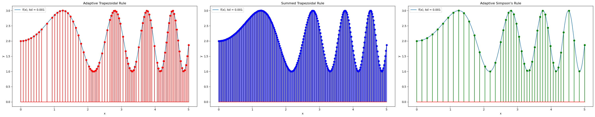
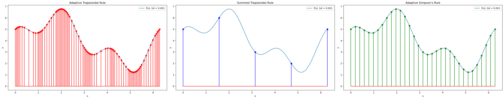

# Numerical Integration Experiments

This repo contains a small reproducible study of **composite trapezoidal-rule convergence** (and a few related quadrature tricks) carried out for the Numerik II module.  All code is pure Python; the results are shown in a Jupyter notebook and summarised in the accompanying PDF report.

---
## Numerical results

The notebook benchmarks three quadrature routines on two test functions  
*(all figures are generated automatically in `notebooks/2.Project_Numerical Experiments.ipynb`)*:

| Function | Definition | Interval |
|----------|------------|----------|
| **$f_{1}(x)$** | $2+\sin(x^{2})$ | $[0,\,5]$ |
| **$f_{2}(x)$** | $4+2\sin(x)+\cos(3x)$ | $[0,\,2\pi]$ |

---

### Function f₁  — tolerance $\(10^{-3}\)$

*Summary*

* **Adaptive Trapezoidal Rule** – quickly adds points in high-variation regions  
  *error ≈ 5.5 × 10⁻⁵, evaluations = 91*
* **Summed Trapezoidal Rule** – needs many more points for similar accuracy  
  *error ≈ 3.2 × 10⁻⁴, evaluations = 257*
* **Adaptive Simpson’s Rule** – slightly better accuracy with fewer points  
  *error ≈ 2.5 × 10⁻³, evaluations = 45*

---

### Function f₂  — tolerance $\(10^{-3}\)$

*Summary*

* **Adaptive Trapezoidal Rule** – efficient again despite oscillations  
  *error = 0, evaluations = 85*
* **Summed Trapezoidal Rule** – highest accuracy with **very** few samples  
  *error = 0, evaluations = 5*
* **Adaptive Simpson’s Rule** – slightly worse here, more calls than f₁  
  *error ≈ 3.6 × 10⁻¹⁴, evaluations = 33*

---

*All errors are absolute; “evaluations” counts function calls.*

